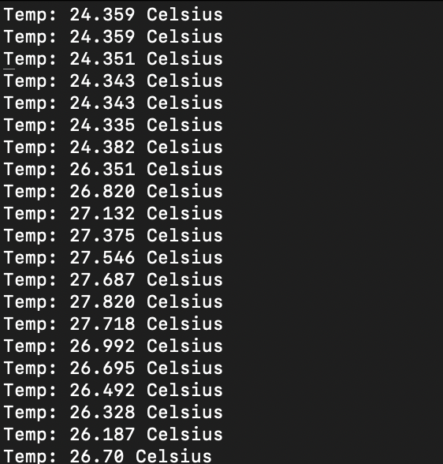
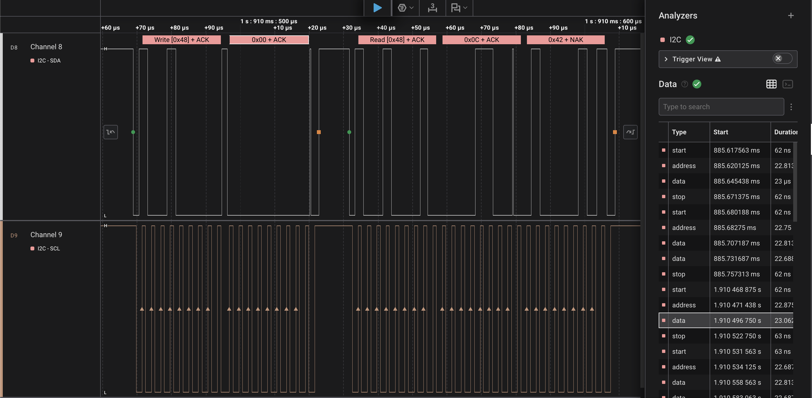

# Phase 3 Answers
Phase 3 is about learning basics of I2C communication and driver development.

## targets/phase3/main.cpp
- Create/Setup I2C
```cpp
io::I2C& i2c = io::getI2C<io::Pin::PB_8, io::Pin::PB_9>();
```

- Create/Setup the TMP117
```cpp
rampup::TMP117 tmp(i2c, i2cSlaveAddress);
```

- Call the readTemp(...) function
```cpp
uint16_t temperature;
io::I2C::I2CStatus status = tmp.readTemp(temperature);
```

- Print result
```cpp
uart.printf("Temp: %d.%d Celsius\n\r", temperature / 100, temperature % 100);
```

Look at targets/phase3/main.cpp for completed implementation.

## src/dev/TMP117.cpp readTemp() Implementation

- Setting up variables
```cpp
uint8_t registerValue = TEMP_REG;
uint8_t outputBuffer[2];
```

- Reading from i2c
```cpp 
io::I2C::I2CStatus status = i2c.readReg(i2cSlaveAddress, &registerValue, 1, outputBuffer, 2);
``` 

- Combining the raw output from the sensor
```cpp
rawOutput = (outputBuffer[0] << 8) | outputBuffer[1]
```

- Converting raw output into either milli-celsius (preferred) or celsius
```cpp
output = rawOutput * 78125 / 10000 // milli-celsius
// Or
output = rawOutput * 78125 / 10000000 // celsius
```

Look at src/dev/TMP117.cpp for completed implementation.

## Expected UART output


## Saleae Expected Image


## FAQ
Any commonly asked questions and their answers should be recorded here. Keep track of what questions
you get asked, and if there are common ones make sure to add them to this document.

1.
    - Q:
    - A: 
